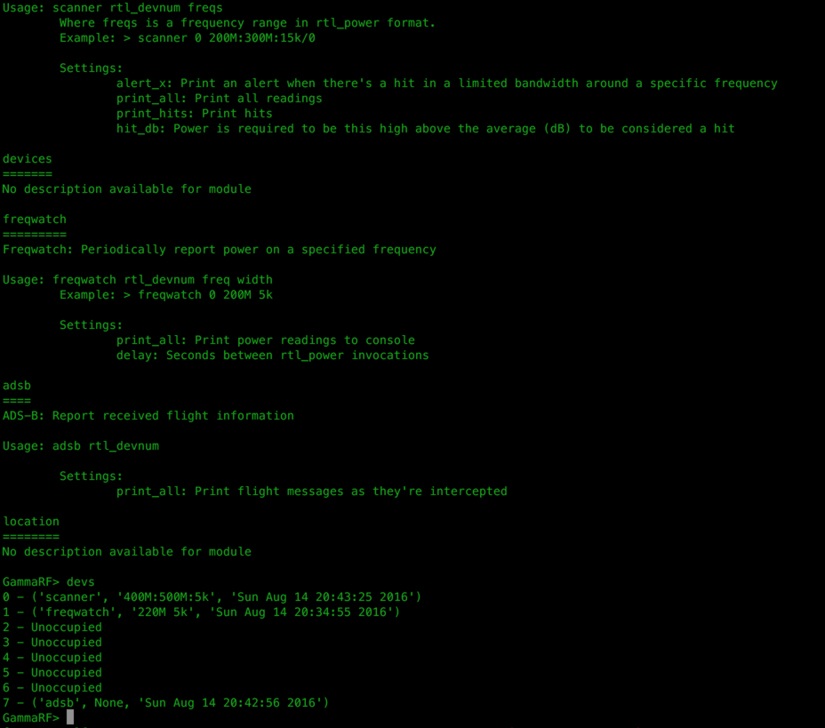

ΓRF
===

ΓRF is a powerful, flexible, extendable system for radio enthusiasts. It
leverages cheap (~$20) software defined radio receivers and free software to
provide users with tools that can assist in a diverse array of applications.
  
See http://gammarf.io for installation and use instructions.
